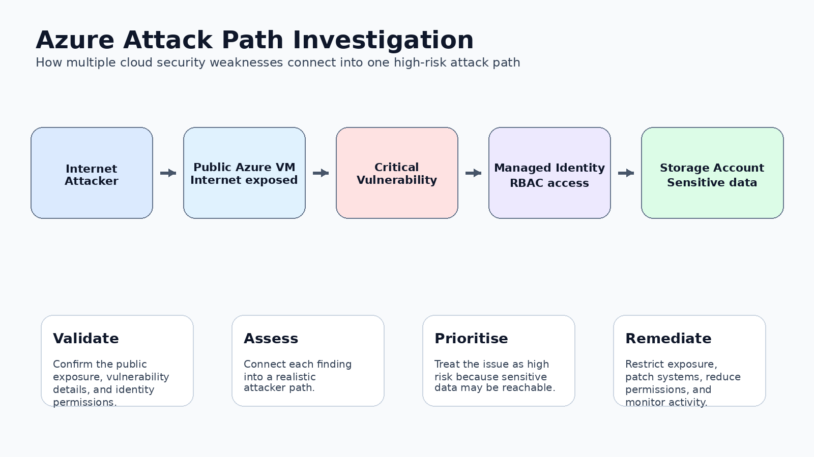

# Azure Attack Path Cloud Security Investigation



## Overview

This project is a cloud security investigation lab focused on analysing a potential Azure attack path.

The scenario simulates a publicly exposed Azure Virtual Machine with a critical vulnerability, an assigned Managed Identity, and access to a Storage Account containing potentially sensitive business data.

This lab is designed to demonstrate beginner-to-entry-level Cloud Security and SOC investigation thinking using a structured, evidence-based approach.

## Scenario Summary

Microsoft Defender for Cloud identifies a potential attack path:

**Internet-exposed VM → Critical vulnerability → Managed Identity → Storage Account → Sensitive data exposure**

## Objective

The objective of this lab is to practise:

- Cloud security investigation
- Azure attack path analysis
- Public exposure review
- Vulnerability risk assessment
- Managed Identity and RBAC review
- Storage Account access risk analysis
- Security documentation
- Consultant-style reporting

## Skills Practised

- Azure security fundamentals
- Microsoft Defender for Cloud concepts
- Network Security Group review
- Attack path analysis
- Vulnerability management
- Identity and access risk assessment
- RBAC and least privilege review
- Storage security
- Incident triage
- Finding, Evidence, Risk, Recommendation, Priority documentation

## Key Security Concepts

| Concept | Why it matters |
|---|---|
| Internet exposure | Public-facing resources are easier for attackers to discover and target. |
| Critical vulnerability | Known vulnerabilities on exposed assets should be prioritised. |
| Managed Identity | Useful for secure Azure access, but risky if the host is compromised. |
| RBAC | Excessive permissions can increase blast radius. |
| Storage Account | May contain sensitive data, logs, backups, reports, or configuration files. |
| Attack path | Real cloud risk often appears when multiple weaknesses connect together. |

## Key Finding

A publicly exposed Azure Virtual Machine with a critical vulnerability and a Managed Identity that can access sensitive storage creates a high-risk attack path.

## Risk Summary

If an attacker exploits the vulnerable VM, they may be able to abuse the VM's Managed Identity to access the Storage Account and potentially read or exfiltrate sensitive data.

## Recommendation Summary

The organisation should:

- Restrict public access to the VM.
- Patch or mitigate the critical vulnerability.
- Review and reduce Managed Identity permissions.
- Apply least privilege.
- Review Storage Account permissions and data sensitivity.
- Enable logging and monitoring.
- Monitor for suspicious authentication and storage access activity.

## Project Structure

```text
azure-attack-path-cloud-security-investigation/
│
├── README.md
├── scenario.md
├── attack-path/
│   └── attack-path-analysis.md
├── evidence/
│   ├── exposed-vm.md
│   ├── vulnerability-evidence.md
│   ├── managed-identity-risk.md
│   └── storage-access-risk.md
├── investigation/
│   └── investigation-notes.md
├── report/
│   └── cloud-security-report.md
├── recommendations/
│   └── remediation-plan.md
├── assets/
│   ├── azure-attack-path-overview.png
│   ├── azure-attack-path-overview.svg
│   ├── investigation-workflow.png
│   └── risk-priority-matrix.png
└── screenshots/
    └── README.md
```

## Status

Completed as part of my Cloud Security and SOC Analyst learning portfolio.
---

## What This Lab Demonstrates

This lab demonstrates my ability to analyse a cloud security attack path, connect multiple findings together, assess business risk, and document clear remediation actions.

The focus is not only on identifying one misconfiguration, but on understanding how public exposure, vulnerabilities, identity permissions, and sensitive data access can combine into a realistic cloud security risk.
