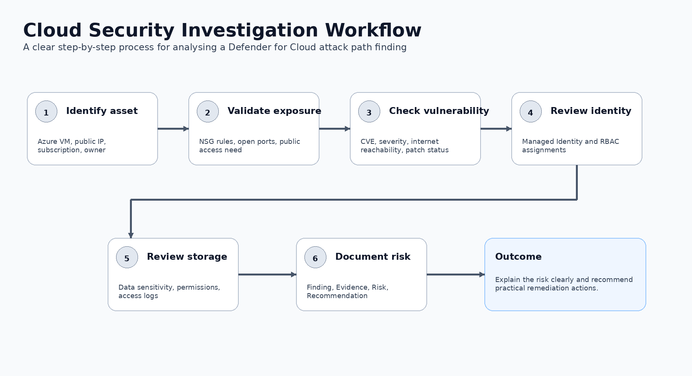

# Investigation Notes

## Step 1: Identify the affected asset

Affected asset: Azure Virtual Machine  
Exposure: Internet-facing  
Security tool: Microsoft Defender for Cloud  
Risk type: Attack path involving vulnerability, identity, and data exposure

## Step 2: Review public exposure

The VM should be checked for:

- Public IP address
- Network Security Group inbound rules
- Open administrative ports
- Business justification for public access
- Existing controls such as Azure Bastion, VPN, firewall, or Just-in-Time access

## Step 3: Review vulnerability

The vulnerability should be checked for:

- CVE reference
- Severity rating
- Affected software
- Patch availability
- Whether the service is reachable from the Internet
- Whether exploitation evidence exists

## Step 4: Review Managed Identity

The identity permissions should be reviewed to determine:

- What Azure resources it can access
- Whether permissions are excessive
- Whether least privilege is applied
- Whether access to storage is required
- Whether the identity has broad roles such as Owner or Contributor

## Step 5: Review Storage Account access

The Storage Account should be reviewed for:

- Sensitive data
- RBAC permissions
- Access logs
- Public access settings
- Encryption and data protection controls
- Unusual data access patterns

## Step 6: Determine business impact

Possible business impact includes:

- Unauthorised access to sensitive data
- Data exfiltration
- Credential or token abuse
- Lateral movement within Azure
- Compliance and reputational risk
- Operational disruption

## Step 7: Severity assessment

Severity: **High**

Reason: The attack path combines public exposure, a critical vulnerability, cloud identity permissions, and access to sensitive data.

## Step 8: Escalation Decision

This finding should be escalated because it represents a realistic path from an exposed vulnerable asset to sensitive data access.
