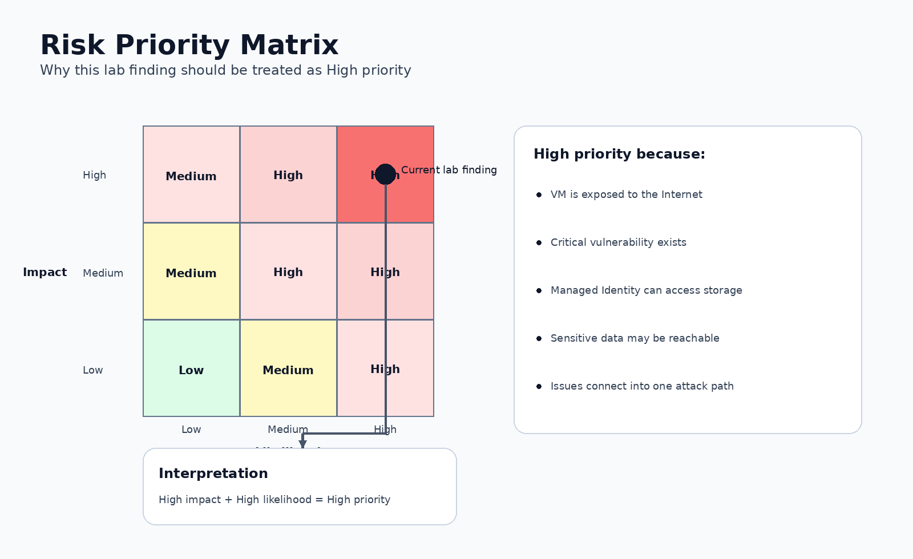

# Remediation Plan

## Immediate Actions

1. Restrict public access to the VM.
2. Remove unnecessary inbound Network Security Group rules.
3. Patch or mitigate the critical vulnerability.
4. Review recent authentication and access logs.
5. Review Managed Identity permissions.
6. Confirm whether the Storage Account contains sensitive data.
7. Check for unusual storage access activity.

## Identity and Access Remediation

- Apply least privilege to the Managed Identity.
- Remove unnecessary RBAC assignments.
- Avoid broad roles such as Owner or Contributor where not required.
- Use scoped access at the minimum required level.
- Review all identities with access to sensitive resources.
- Monitor identity activity for suspicious access patterns.

## Network Remediation

- Remove public exposure if not required.
- Restrict access to trusted IP ranges.
- Use VPN or Azure Bastion for administration.
- Avoid exposing SSH or RDP directly to the Internet.
- Review Network Security Group rules regularly.
- Consider Just-in-Time VM access.

## Vulnerability Remediation

- Apply vendor patches.
- Remove or disable vulnerable services if not required.
- Prioritise vulnerabilities on internet-facing assets.
- Rescan the resource after remediation.
- Confirm whether the vulnerable service is still reachable.

## Storage Security Remediation

- Review Storage Account access permissions.
- Disable public access if not required.
- Enable logging and monitoring.
- Protect sensitive data with encryption and access controls.
- Monitor unusual data access activity.
- Review retention, backup, and data classification policies.

## Long-Term Improvements

- Use Microsoft Defender for Cloud recommendations.
- Monitor Attack Path Analysis regularly.
- Implement Azure Policy to prevent risky configurations.
- Review privileged identities and Managed Identities.
- Establish a regular cloud security review process.
- Maintain clear documentation for approved access methods.
